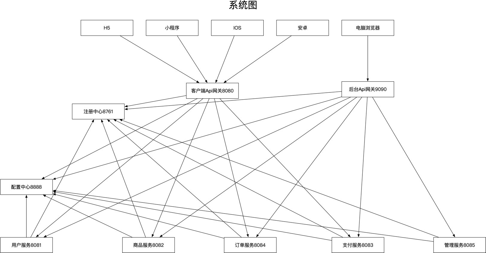
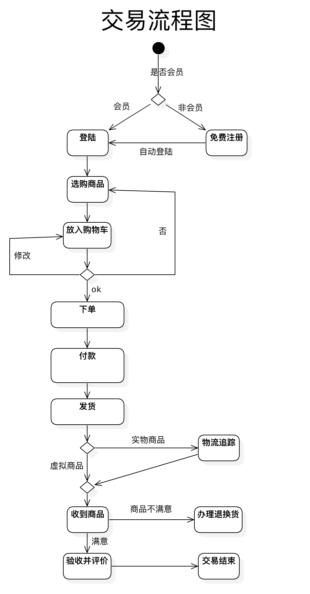

#### 如果你觉得还行，请给个star，感谢你的支持🙏
## QQ交流群：828300414，加群答案：taro-jd
# 一个项目从设计至最终成品的架构，包括设计/前端/管理后台/后端/k8s集群架构（持续开发中......）

### rxjava-apis项目地址：https://github.com/apersonw/rxjava-apis.git (已发布npmjs正式版)
### rxjava项目地址：https://github.com/apersonw/rxjava.git (已发布maven正式版)
### 一、项目使用说明
#### 服务端：
- kubernetes1.14.2：安装方法详见 https://github.com/apersonw/taro-mall/issues/8
- 服务发现采用的k8s，配置采用configMap，说明详见：[Spring-cloud-kubernetes](https://cloud.spring.io/spring-cloud-static/spring-cloud-kubernetes/2.1.0.RC1/)
- 每个模块都是单独的模块，单一模块启动无法联动方法接口无法调用
- 单一模块启动请保证本机安装的有mongodb、rabbitmq、redis，否则会启动报错无法连接
- 每个模块下均有build.sh，可自行修改发布到自己的镜像仓库，然后修改k8s中的deployment.yaml，发布到集群

#### 客户端
- nodejs: v10.15.2

### 二、单独模块启动说明

1. 客户端模块（React Native单独拉取rn分支）
<!-- [演示地址](http://106.12.12.148/) -->
<!-- [设计演示地址](http://106.12.12.148:82/) -->

```bash
# run
# H5启动(yarn dev:weapp为小程序启动)
$ cd client | yarn dev:h5
```

2. 管理后台模块
<!-- [演示地址](http://106.12.12.148:81/) -->

```bash
# run
$ cd manager | yarn start
```

3. 微服务RestFul接口模块
```bash
# run 需要本地启动mongo和redis
# 模块启动顺序 （配置中心）config->(注册中心)center->其他模块
$ cd services/xxx | 启动java项目
```

### 三、目录说明

```
.
├── client                    #客户端,访问地址：0.0.0.0:81
│   ├── Dockerfile
│   ├── docker
│   │   └── nginx.conf        #nginx配置文件
│   ├── package.json
│   ├── src                   #项目源码
├── design                    #设计切图
│   ├── assets
│   ├── index.html
│   ├── links
│   └── preview
├── docker-compose.yml        #项目docker-compose
├── manager                   #管理端,访问地址：0.0.0.0:82
│   ├── Dockerfile
│   ├── docker
│   │   └── nginx.conf        #nginx配置文件
│   ├── package.json
│   ├── public
│   ├── src
├── readmeImg                 #readme引用图片
│   ├── category.jpg
│   └── index.jpg
├── run.sh                    #启动项目运行脚本
├── rxjava-api-core           #api request服务核心包
└── services                  #微服务项目组
    ├── service-goods         #商品微服务
    │   ├── pom.xml
    │   └── src
    └── service-user          #用户微服务
        ├── pom.xml
        └── src

注：（整体启动后）
1.数据库访问地址：0.0.0.0:27018
2.注册中心访问地址：0.0.0.0:8761   账号密码均为：admin
```

### 四、项目架构说明

1. #### 设计说明：

* 采用Sketch设计并发布切图，设计切图位于design文件夹

2. #### 数据来源说明：

- 采用Python Scrapy爬虫爬取相关数据，加群可分享

3. #### 前端说明：

- 客户端模块-基于<a href="https://taro.aotu.io/">Taro</a>+<a href="https://dvajs.com/">Dva</a>
- 管理后台模块-基于<a href="https://umijs.org/">Umi</a>

4. #### 微服务RestFul接口模块说明：

- 项目框架基于<a href="https://docs.spring.io/spring/docs/current/spring-framework-reference/web-reactive.html#spring-webflux">Spring Cloud，Spring Boot2，Spring WebFlux</a>
- 数据库：MonogoDb，Redis，Elasticsearch
- 消息队列：RabbitMq
- 支付平台：支付宝和微信支付



5. #### 部署说明：

- 所有模块部署均采用<a href="https://docker.io/">Docker</a>

### 五、交易流程图


### 六、页面展示

**1、首页展示** 


**2、分类展示**


